# 计图期末大作业

版本：Unity 2022..3.46f1c1

**主要场景：**

Assets/Scenes/Finally Scene

**默认的场景**

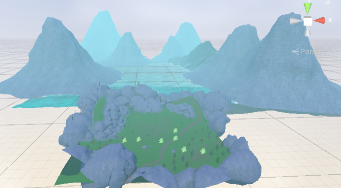

**按2切换为雪景**

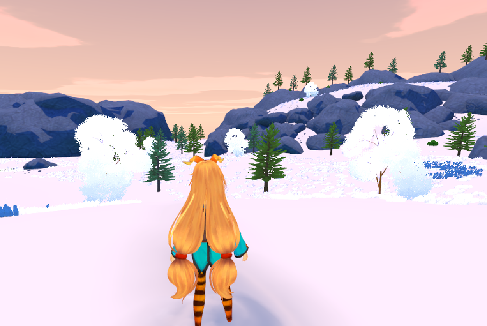

## 实现内容

### 海面

**在Assets/Scenes/Water中有海面的效果演示**

- 菲涅尔效应、水面高光、波纹扰动
- 水面镜面反射
- 水的折射
- 水的波形
- 边缘泡沫

#### 物理波动 

通过**Gerstner波 (Gerstner Wave)** 算法在顶点着色器中实时计算的。

- 代码中定义了 `_Wave1`, `_Wave2`, `_Wave3` 三组波浪参数（方向、陡峭度、波长）。
- **实现**：在 `vert` 函数中调用 `GerstnerWave`，将这三个波的位移叠加到顶点坐标 `v.vertex` 上。这使得水面会有真实的物理起伏，且波峰会变尖（由陡峭度控制），比简单的正弦波更像真实水浪。

#### 表面波纹 

为了表现水面细微的涟漪，使用了**双层法线贴图混合**技术。

- 使用同一张法线贴图 `_WaterNormal`，但采样两次。
- **实现方式**：
  - `panner1` 和 `panner2` 使用了不同的速度 (`_WaveParams`) 和方向。
  - 在 `frag` 函数中，将这两次采样的法线结果进行混合 (`BlendNormals`)。

#### 岸边泡沫与深度感 (深度缓冲)

- **原理**：利用 Unity 的 `_CameraDepthTexture`（场景深度图）。
- **实现**：
  - 计算 `eyeDepth`（场景中物体距离摄像机的距离）与 `screenPos.w`（水面片元距离摄像机的距离）的差值。
  - **差值小**：说明水面紧贴着水下的物体（即岸边或浅水），此时混合出**泡沫颜色** (`_FoamColor`) 并增加透明度。

#### 折射 

- **原理**：使用 `GrabPass { "_CameraOpaqueTexture" }` 抓取当前屏幕画面。
- **实现**：
  - 在 `Refraction` 函数中，根据水面的法线 (`WorldNormal`) 对屏幕 UV 进行偏移。
  - 采样抓取的屏幕纹理。

#### 镜面反射 (Planar Reflection)

- **原理**：代码中使用了 `_ReflectionTexture`。
- 使用外部 C# 脚本在运行时渲染一个倒置的摄像机画面并传给 Shader。
- **实现**：在 `Reflection` 函数中，同样利用法线扰动 UV，并结合菲涅尔效应 (`fresnelReflect`)，使得视角越平视水面，反射越强；垂直看水面时，反射变弱（能看透水底）。

#### 光照模型

使用了自定义的 Blinn-Phong 光照模型：

- **高光 (Specular)**：模拟阳光照射在水面的亮斑。
- **菲涅尔边缘光 (Rim)**：`pow(1-saturate(NdotV), _RimPower)`，让水面边缘（远处）看起来更亮，增强水体的体积感。

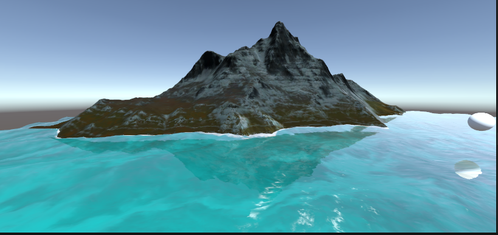

### 草地

**在Assets/Scenes/Main中有效果演示**

- 随机弯曲、旋转、风场效果

- 阴影
- 与碰撞体交互

#### 风的模拟 

- **采样噪声图**
- **UV 滚动**：根据 `_Time` 变量让噪声图的 UV 坐标移动，模拟风吹过草地的波浪感。
- **顶点偏移**：读取噪声图的颜色值，将其作为偏移量加到草叶**顶端**的顶点上（草根不动），实现随风摇摆的效果。

#### 交互 

- **全局变量**：Shader 会接收一个 `_PlayerPosition`。
- **距离检测**：在生成草叶时，计算草根与玩家的距离。
- **压倒逻辑**：如果距离小于阈值，强制将草叶顶端的顶点向下压，并向远离玩家的方向推移。

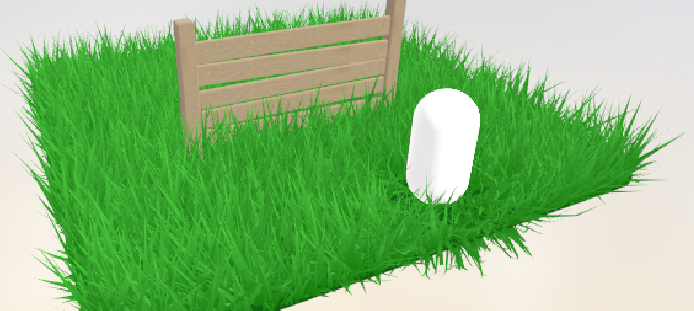

### 雪地

**在Assets/Scenes/Snow中有效果演示**

- 根据深度图以及曲面细分实现雪印的效果

#### 曲面细分

- **距离优化**：使用了 `UnityDistanceBasedTess`。离摄像机近的地方，网格切得非常细；离得远的地方，网格保持稀疏。

#### 交互式脚印 

- **原理**：使用了一个额外的摄像机（`SnowCamera`）和两张 **RenderTexture (RT)**。
- **流程**：
  1. **深度捕捉**：`SnowCamera` 从下往上拍，只渲染玩家脚底的深度信息。
  2. **累积绘制**：脚本会在两张 RT 之间来回倒腾。上一帧的脚印图 + 这一帧新踩的位置 = 新的脚印图。
  3. **传递给 Shader**：这张累积了所有脚印信息的 RT 被传给雪地 Shader。

#### 顶点位移

- **采样**：在顶点着色器 (`disp` 函数) 中，根据当前顶点的 UV 采样那张脚印图。
- **下陷**：如果采样到的颜色是红色（代表有脚印），就将该顶点沿法线方向**向下移动**（`v.vertex.xyz -= v.normal * amount`）。

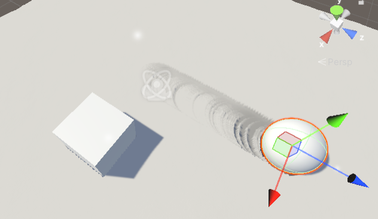

### 雪地Version2

​	上面这个方案对精度要求比较高，在大地图上很容易会因为精度问题导致失效。于是为了将雪景融入final，我换了另一种方式。仅仅通过修改法线，影响光照着色来凸显下凹的视觉效果。

- **玩家/角色脚本每帧更新位置**
  - 见 `InteractWithSnowOrSand.cs`
  - `Update()` 里先做：`Shader.SetGlobalVector("_PlayerPos", transform.position);`
  - 然后计算位移：`_DeltaPos = transform.position - LastPlayerPos`（只要位移足够大才更新）
- **用 StepGenerator 把“脚印”写进一张 RT（脚印缓存纹理）**
  - 仍在 `InteractWithSnowOrSand.cs`
  - 通过双缓冲（ping-pong）避免读写同一张 RT：
    - `Graphics.Blit(StepRT, mTmpRT);` 复制历史结果
    - `Graphics.Blit(mTmpRT, StepRT, StepMat, 0);` 用 StepMat 的 Pass0（Trace Generation）把新结果写回 StepRT
- **平移旧脚印 + 新脚印**
  - 见 `StepGenerator.shader`
  - 旧脚印跟随玩家位移做 UV 偏移：`tex2D(_MainTex, uv + _DeltaPos.xz * 0.015)`
    - 目的是让脚印“留在世界里”，玩家走动时历史纹理相对移动
  - 新脚印来自 `_StepBump`（印章贴图），在纹理中心缩放采样并和历史结果融合
    - 用 alpha 控制覆盖：只在新印章更“强”时才叠上去
- **Init Pass 用来清空/初始化 RT**
  - 见 `StepGenerator.shader`
  - 输出固定值 `float4(0.5, 0.5, 1, 0)`（平坦法线 + 无脚印遮罩）
- **雪地渲染时读取 StepRT，当作脚印法线+遮罩**
  - 见 `SnowWithStep.shader`
  - 用世界坐标差值采样脚印 RT：
    - `stepUV = (worldPos.xz - _PlayerPos.xz) * _StepUVScale + 0.5`
  - `stepNormalCol.rgb` 当法线扰动，`stepNormalCol.a` 当脚印遮罩 `stepMask`
  - `stepMask` 用来：
    - 加强法线（让凹凸更明显）
    - 轻微压暗雪色（让脚印轮廓更清晰）

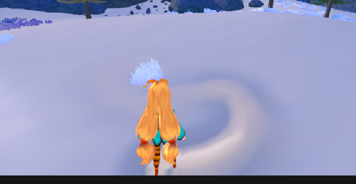

### 随时间变化的天空盒

#### 星星纹理

1. 创建透明背景的纹理
2. 随机分布指定数量的星星点
3. 使用高斯衰减函数绘制星星（中心亮、边缘渐变）
4. 10%概率生成更亮的"亮星"
5. 输出带透明通道的PNG纹理

#### 云朵纹理：

1. 使用分形布朗运动(FBM)生成基础噪声
2. 应用域扭曲破坏对称性
3. 多层噪声混合：

  \- 基础低频云形状

  \- 高频细节噪声

4. 对比度/阈值处理形成云块边界
5. 边缘填充处理（隐藏拼接痕迹）

- 远处的云

- 近处的云

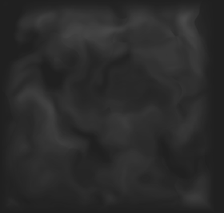

### 自制树

**使用blender制作树干和树叶的mesh**

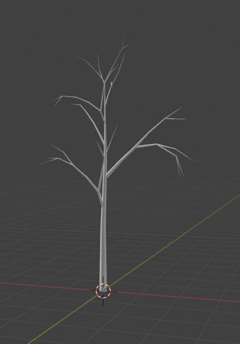

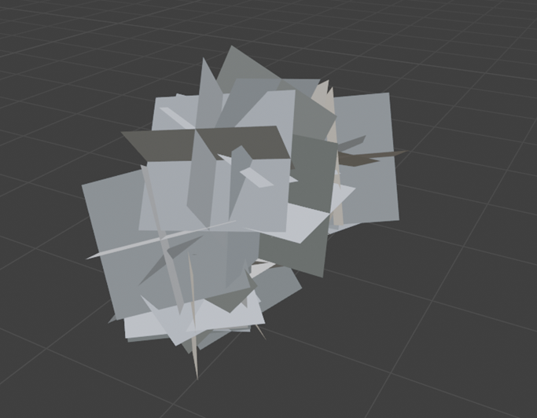

**使用一个“罩子”，将所有叶子实体合并，然后将罩子的法线统一映射到树叶中**

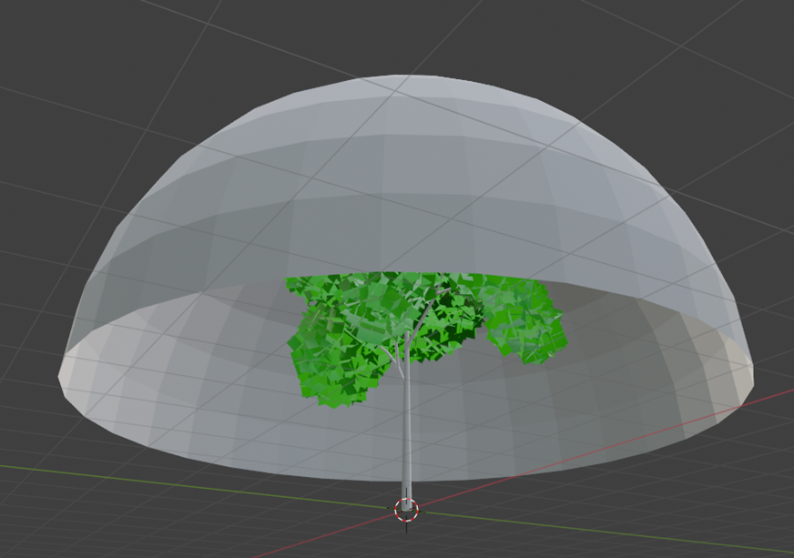

​	**最后将模型以fbx的格式导入unity,加入光线效果，补上贴图（如果不进行烘焙从blender到unity贴图会丢失，所以这里直接选择在unity再上一边贴图）**

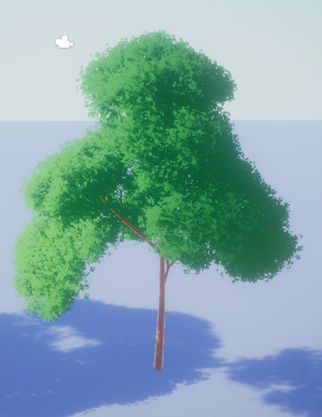

​	**最后通过LODGroup实现LOD**

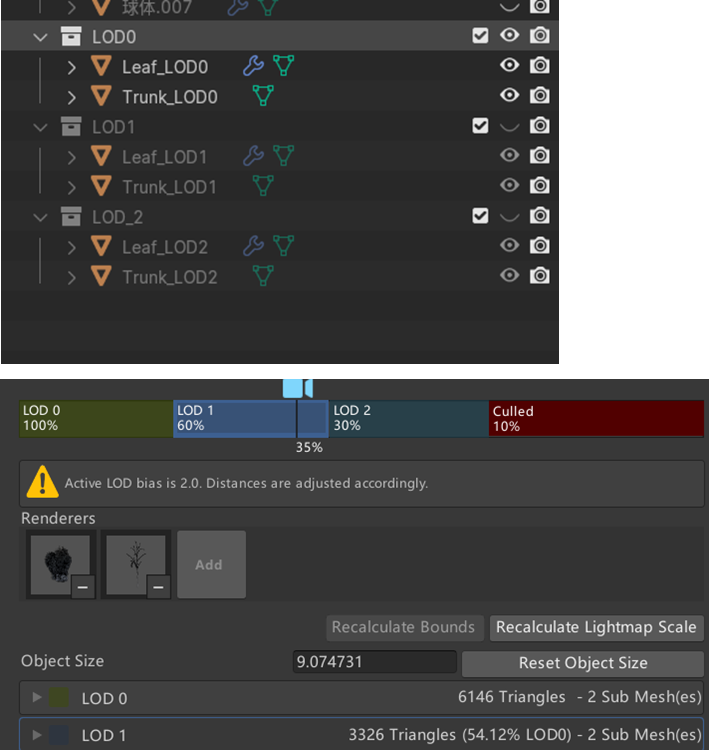

### Unity-chan

​	很简单的实现，设置一个状态机，通过脚本控制即可

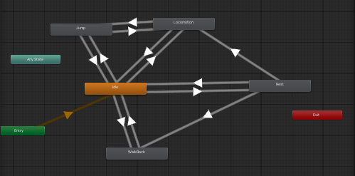
