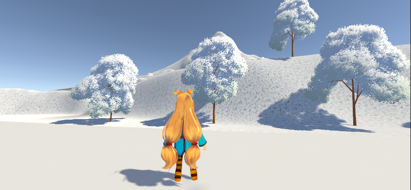

# 计图期末大作业

版本：Unity 2022..3.46f1c1

主要场景：

- Assets/Scenes/Finally Scene

- Assets/Scenes/Snow Scene（目前实现了基本的雪场景，后续将其融入FinalScene中）

	

## 实现内容

### 海面

**在Assets/Scenes/Water中有海面的效果演示**

- 菲涅尔效应、水面高光、波纹扰动
- 水面镜面反射
- 水的折射
- 水的波形
- 边缘泡沫

#### 物理波动 

通过**Gerstner波 (Gerstner Wave)** 算法在顶点着色器中实时计算的。

- 代码中定义了 `_Wave1`, `_Wave2`, `_Wave3` 三组波浪参数（方向、陡峭度、波长）。
- **实现**：在 `vert` 函数中调用 `GerstnerWave`，将这三个波的位移叠加到顶点坐标 `v.vertex` 上。这使得水面会有真实的物理起伏，且波峰会变尖（由陡峭度控制），比简单的正弦波更像真实水浪。

#### 表面波纹 

为了表现水面细微的涟漪，使用了**双层法线贴图混合**技术。

- 使用同一张法线贴图 `_WaterNormal`，但采样两次。
- **实现方式**：
  - `panner1` 和 `panner2` 使用了不同的速度 (`_WaveParams`) 和方向。
  - 在 `frag` 函数中，将这两次采样的法线结果进行混合 (`BlendNormals`)。

#### 岸边泡沫与深度感 (深度缓冲)

- **原理**：利用 Unity 的 `_CameraDepthTexture`（场景深度图）。
- **实现**：
  - 计算 `eyeDepth`（场景中物体距离摄像机的距离）与 `screenPos.w`（水面片元距离摄像机的距离）的差值。
  - **差值小**：说明水面紧贴着水下的物体（即岸边或浅水），此时混合出**泡沫颜色** (`_FoamColor`) 并增加透明度。

#### 折射 

- **原理**：使用 `GrabPass { "_CameraOpaqueTexture" }` 抓取当前屏幕画面。
- **实现**：
  - 在 `Refraction` 函数中，根据水面的法线 (`WorldNormal`) 对屏幕 UV 进行偏移。
  - 采样抓取的屏幕纹理。

#### 镜面反射 (Planar Reflection)

- **原理**：代码中使用了 `_ReflectionTexture`。
- 使用外部 C# 脚本在运行时渲染一个倒置的摄像机画面并传给 Shader。
- **实现**：在 `Reflection` 函数中，同样利用法线扰动 UV，并结合菲涅尔效应 (`fresnelReflect`)，使得视角越平视水面，反射越强；垂直看水面时，反射变弱（能看透水底）。

#### 光照模型

使用了自定义的 Blinn-Phong 光照模型：

- **高光 (Specular)**：模拟阳光照射在水面的亮斑。
- **菲涅尔边缘光 (Rim)**：`pow(1-saturate(NdotV), _RimPower)`，让水面边缘（远处）看起来更亮，增强水体的体积感。

### 草地

**在Assets/Scenes/Main中有效果演示**

- 随机弯曲、旋转、风场效果

- 阴影
- 与碰撞体交互

#### 风的模拟 

- **采样噪声图**
- **UV 滚动**：根据 `_Time` 变量让噪声图的 UV 坐标移动，模拟风吹过草地的波浪感。
- **顶点偏移**：读取噪声图的颜色值，将其作为偏移量加到草叶**顶端**的顶点上（草根不动），实现随风摇摆的效果。

#### 交互 

- **全局变量**：Shader 会接收一个 `_PlayerPosition`。
- **距离检测**：在生成草叶时，计算草根与玩家的距离。
- **压倒逻辑**：如果距离小于阈值，强制将草叶顶端的顶点向下压，并向远离玩家的方向推移。

### 雪地

**在Assets/Scenes/Snow中有效果演示**

- 根据深度图以及曲面细分实现雪印的效果

#### 曲面细分

- **距离优化**：使用了 `UnityDistanceBasedTess`。离摄像机近的地方，网格切得非常细；离得远的地方，网格保持稀疏。

#### 交互式脚印 

- **原理**：使用了一个额外的摄像机（`SnowCamera`）和两张 **RenderTexture (RT)**。
- **流程**：
  1. **深度捕捉**：`SnowCamera` 从下往上拍，只渲染玩家脚底的深度信息。
  2. **累积绘制**：脚本会在两张 RT 之间来回倒腾。上一帧的脚印图 + 这一帧新踩的位置 = 新的脚印图。
  3. **传递给 Shader**：这张累积了所有脚印信息的 RT 被传给雪地 Shader。

#### 顶点位移

- **采样**：在顶点着色器 (`disp` 函数) 中，根据当前顶点的 UV 采样那张脚印图。
- **下陷**：如果采样到的颜色是红色（代表有脚印），就将该顶点沿法线方向**向下移动**（`v.vertex.xyz -= v.normal * amount`）。

### 随时间变化的天空盒
